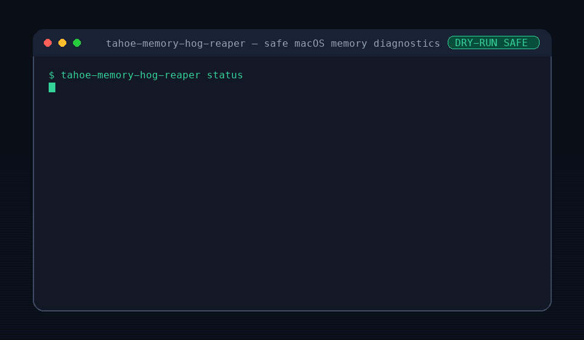

# Tahoe Memory Hog Reaper

<p align="center">
  
</p>

<p align="center">
  <a href="https://github.com/00xmorty/tahoe-memory-hog-reaper/actions/workflows/ci.yml"></a>
  <a href="https://github.com/00xmorty/tahoe-memory-hog-reaper/releases/tag/v0.1.0"></a>
  <a href="LICENSE"></a>
  
  
</p>

<p align="center">
  A tiny, safe macOS CLI for spotting runaway memory hogs before your Mac hits<br>
  <strong>“out of application memory”</strong>.
</p>

---

## Why this exists

Sometimes one background app quietly eats tens of gigabytes of RAM. Then the whole Mac slows down, the beachball appears, and Activity Monitor becomes one more thing you have to fight through.

Tahoe Memory Hog Reaper gives you a single terminal command that answers:

- Is memory pressure bad right now?
- Is swap being used?
- Which processes are the biggest RSS consumers?
- Which process is likely the hog?
- Can I safely inspect a candidate before doing anything destructive?

It is intentionally boring where it matters: no sudo, no daemon, no automatic killing.

## Highlights

- 🧠 Shows memory pressure, swap/VM summary, and top RSS processes.
- 🔎 Scans for candidate memory hogs above a configurable GB threshold.
- 🧯 Has an interactive `reap` mode, but it is dry-run by default.
- 🛡️ Refuses protected system-critical process names.
- 🧰 Uses standard macOS command-line tools.
- 🧪 Ships with smoke tests and macOS GitHub Actions CI.
- 🪶 Single zsh file. Easy to read, copy, audit, and delete.

## Install

Clone and run directly:

```sh
git clone https://github.com/00xmorty/tahoe-memory-hog-reaper.git
cd tahoe-memory-hog-reaper
chmod +x tahoe-memory-hog-reaper.zsh
./tahoe-memory-hog-reaper.zsh status
```

Optional: put it on your `PATH`:

```sh
cp tahoe-memory-hog-reaper.zsh /usr/local/bin/tahoe-memory-hog-reaper
chmod +x /usr/local/bin/tahoe-memory-hog-reaper
tahoe-memory-hog-reaper status
```

## Quick start

```sh
# Full diagnostic view
./tahoe-memory-hog-reaper.zsh status

# Show processes above 20 GB RSS
./tahoe-memory-hog-reaper.zsh scan --threshold-gb 20

# Safe dry-run reaper flow; does not signal anything by default
./tahoe-memory-hog-reaper.zsh reap --interactive --threshold-gb 40
```

## Command reference

### `status`

Prints a compact diagnostic snapshot:

- memory pressure summary
- swap usage
- VM statistics
- top resident-memory processes

```sh
./tahoe-memory-hog-reaper.zsh status
```

### `scan --threshold-gb N`

Lists candidate processes whose RSS is above `N` GB.

```sh
./tahoe-memory-hog-reaper.zsh scan --threshold-gb 20
```

Example:

```text
Candidates above 20GB RSS:
  PID     RSS_GB  PROTECTED  COMMAND
  12345   24.81   no         /Applications/Example.app/Contents/MacOS/Example
```

### `reap --interactive --threshold-gb N`

Shows candidate processes and explains the safety model.

```sh
./tahoe-memory-hog-reaper.zsh reap --interactive --threshold-gb 40
```

By default, `reap` is a dry-run. To send `TERM`, you must explicitly pass `--confirm` and then type the target PID exactly.

```sh
./tahoe-memory-hog-reaper.zsh reap --interactive --threshold-gb 40 --confirm
```

### `--version`

```sh
./tahoe-memory-hog-reaper.zsh --version
```

## Safety model

Tahoe Memory Hog Reaper is diagnostic-first.

| Behavior | v0.1.0 |
| --- | --- |
| Requires sudo | No |
| Runs a daemon / LaunchAgent | No |
| Kills automatically | No |
| `reap` dry-runs by default | Yes |
| Requires exact PID confirmation before `TERM` | Yes |
| Denylists system-critical process names | Yes |

Protected process names include:

```text
kernel_task launchd WindowServer loginwindow syslogd notifyd opendirectoryd
```

If you want a tool that automatically kills processes in the background, this is not that tool. If you want a small auditable CLI that helps you understand what is happening before you act, this is that tool.

## Requirements

- macOS
- `zsh`
- Standard macOS tools: `ps`, `awk`, `sort`, `head`, `sysctl`, `vm_stat`
- Optional: `memory_pressure` when available on your macOS version

## Test

```sh
bash tests/test_tahoe_memory_hog_reaper.sh
```

The smoke test validates:

- zsh syntax
- help output
- version output
- high-threshold scan path
- dry-run `reap` path

## Design principles

1. Report before acting.
2. Prefer explicit thresholds over hidden heuristics.
3. Never require elevated privileges for basic diagnostics.
4. Make destructive behavior impossible to trigger accidentally.
5. Keep the whole tool small enough to audit in one sitting.

## Roadmap

- Better formatting for long command names.
- Optional JSON output for scripting.
- Safer process grouping for helper-heavy apps.
- Homebrew formula if the tool proves useful.
- More tests around parser edge cases.

Non-goals for now:

- Background auto-kill daemon.
- LaunchAgent installer.
- Aggressive process management.
- Cross-platform support.

## Contributing

Issues and small pull requests are welcome. Please keep the safety model intact: diagnostic-first, no sudo, no automatic killing.

Before opening a PR, run:

```sh
bash tests/test_tahoe_memory_hog_reaper.sh
```

## License

MIT
